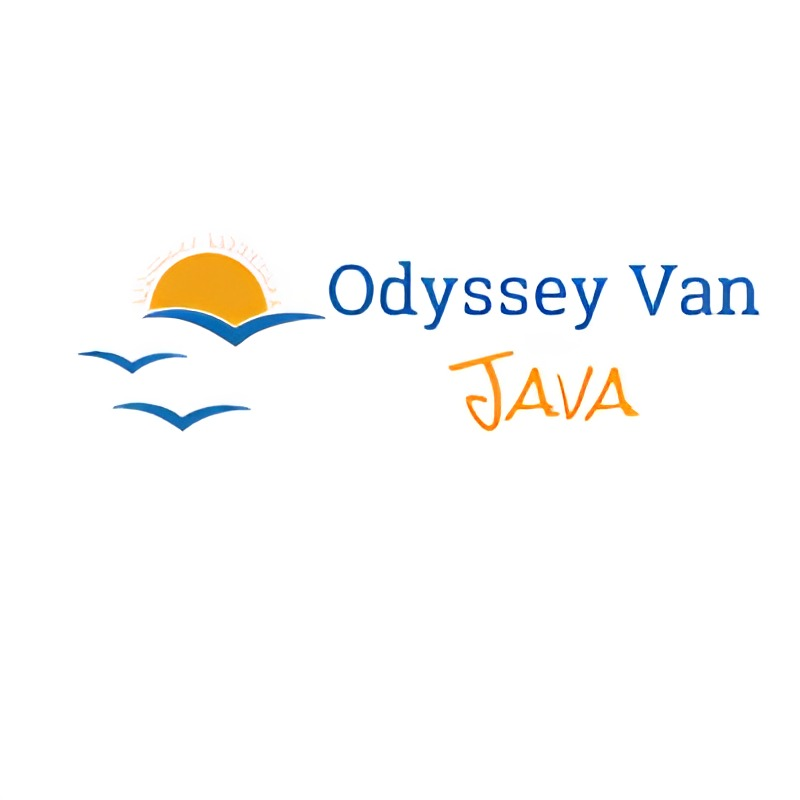

 

  

 

# OVJ - Odyssay Van Java Apps

OVJ-Apps : Odyssey Van Java GitHub Repositories of Bangkit Academy 2023 H2 Capstone Project from 3 learning path. Machine Learning, Mobile development, Cloud Computing from team CH2-PS419.

# About The Project

# Team Members

## Team ID : CH2-PS419

 

| Name                     | Student ID  | Path                |
| ---------------------    | ----------  | ------------------- |
| Ceceng Shufyan Yahya     | M005BSY1242 | Machine Learning    |
| Hasyimi Ulil Abshor      | M006BSY1433 | Machine Learning    |
| Zakiah Aulia Romah       | M560BSX0261 | Machine Learning    |
| Ramadhani Dwi Noviansyah | C560BSY3256 | Cloud Computing     |
| Elsa Novita              | C701BSX4204 | Cloud Computing     |
| Amirul Mubarok           | A560BSY2075 | Android Development |

 

# Resource

In our project is divided into four branches.

1. [main](https://github.com/PS419-OVJ/OVJ-apps/tree/main)
2. [mobile-development](https://github.com/PS419-OVJ/OVJ-apps/tree/mobile-development)
3. [cloud-computing](https://github.com/PS419-OVJ/OVJ-apps/tree/cloud-computing)
4. [machine-learning](https://github.com/PS419-OVJ/OVJ-apps/tree/machine-learning)

# Getting Started

- **Prerequisites**

  1.  Android
  2.  Internet connection
  3.  GPS/Location

- **Installation**

  1.  Download the APK
  2.  Install the APK

- **Register**

  1.  Open OVJ application
  2.  Register your email address

# Usage

- How to find the nearest tourist spots

  1.  Login to your accounts
  2.  Click on search button
  3.  Input your current location
  4.  OVJ will recommend you the nearest tourist spots

- How to find the tourist spot based on time and cost (we make package of trip plan base on the cost and time)

  1.  Login to your accounts
  2.  Click Recommendation trip plan
  3.  Chose the trip plan

- How to get the shortest route from the several tourist destination

  1.  You can choose from ‘trip plan’ there are already several tourist destination in there or you can chose tourist destination one by one and then click next
  2.  You will direct to next page that will show you a solution of the best and shortest route

# Product

[OVJ Apps](#)
    

# Technology Used

1. Machine Learning
   - [Tensorflow](https://www.tensorflow.org/)
   - [Python](https://www.python.org/)
2. Mobile Development
   - [Kotlin](https://kotlinlang.org/)
   - [Firebase](https://firebase.google.com/)
3. Cloud Computing
   - [Node.js](#)
   - [Google Compute Engine](https://cloud.google.com/compute)
   - [Google App Engine](https://cloud.google.com/appengine)
   - [Google Cloud SQL](https://cloud.google.com/sql)
4. Design
   - [Figma](https://www.figma.com/file/pJ59hWcJSTAF1tQfbjI0jk/Design?node-id=0%3A1)
      

# API Documentation

For API documentation, see the following link [REST APIs](https://github.com/PS419-OVJ/OVJ-apps/blob/cloud-computing/README.md#rest-apis)

# Contributing

We are very open to any input, therefore we want to make contributing to this project as easy and transparent as possible, whether it's:

- Reporting a bug
- Discussing the current state of the code
- Submitting a fix
- Proposing new features
- Becoming a maintainer

If you think something important is missing or should be different based on your experience, we'd love to have you contribute to this project. If you have suggestions for improving these apps, please [contact](https://github.com/PS419-OVJ/OVJ-apps#Contact) the existing ones.

# Contact

| Name                  | Contact                                                                                                                                                                                                                                                                                                                                        |
| --------------------- | ---------------------------------------------------------------------------------------------------------------------------------------------------------------------------------------------------------------------------------------------------------------------------------------------------------------------------------------------- |
| Ceceng Shufyan Yahya  |                     |
| Hasyimi Ulil Abshor   |                     |
| Zakiah Aulia Romah   |                     |
| Ramadhani Dwi Noviansyah  |                     |
| Elsa Novita  |                     |
| Amirul Mubarok  |                     |
                   
# Acknowledgments

<!-- reference https://github.com/alexandresanlim/Badges4-README.md-Profile -->
